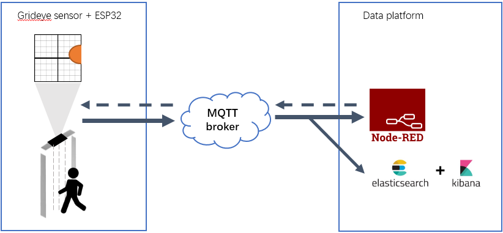
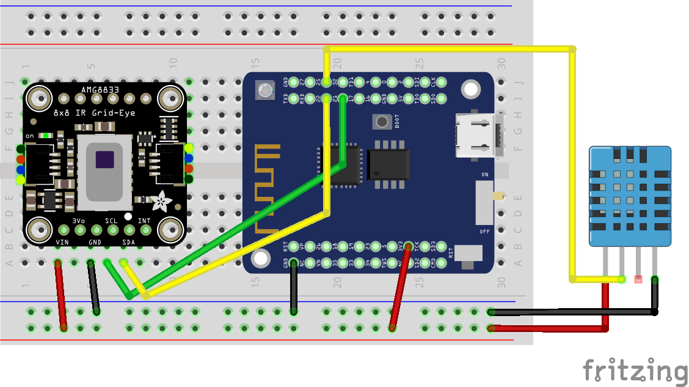
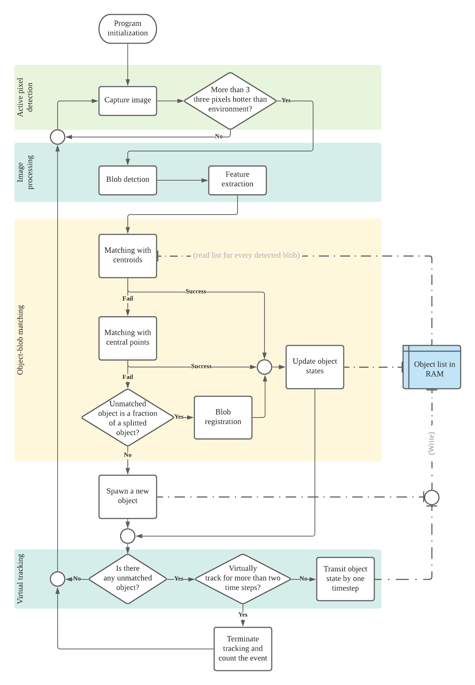

# IR-Room-Monitor manual

## What is this

This is the source code of a personnel counting device. The device is mounted on the top of a door frame, monitoring an area of about $3m^2$ below it. The device is able to count human enter/leave events relatively, and offers an human count value in the building. The count value can be used for optimization of heating, ventilation and air-condition usage of the building or occupancy control during the Corona pandemic. 

The device is developed with a ESP32 board and an infrared thermopile array (Grideye Amg8833). It uses a traditional blob tracking based method. Data are transfered to a centralized data bank through MQTT.    

Two platforms are used in this project. One of them is Node-Red for debug purpose, which visualizes the real-time camera data stream, show internal states of the device and send new configuration to the device. The other is the CAPS IoT Platform based on ElasticSearch+Kibana, developed by TUM researchers, which stores the count value published by the device in a data bank for long-term evaluation. Configurations of both platforms will also be introduced later in this document.

## How to run it

To compile and flash the source code to an ESP32 board, go to `./main` and use the command `idf.py -p <port_name> flash monitor` from the ESP-IDF.

### in-situation use case

Read camera frames from the termopile sensor.

1. Hardware Circuiting: The thermopile sensor Grideye Amg8833 uses I2C interface. By default, the SDA pin and SCL pin on ESP32 are 22 and 21 relatively (however, they are configurable to any digital pin). 

   

| ESP32           | 22 (SDA) | 21 (SCL) | GND  | 3.3V |
| --------------- | -------- | -------- | ---- | ---- |
| Grideye Amg8833 | SDA      | SCL      | GND  | Vin  |

2. Configuration of the network: the device need to publish the latest count value to outside through MQTT. So Wifi & MQTT connection need to be established at first. Go to `macro.h` under `/main` and change the Wifi SSID, password and MQTT uri (and MQTT username and password if applicable).

3. Configuration of the SNTP server: we need the timestamp of an event to see when did it happen. The realtime timestamp is retrieved from the router before the program is running. Choose a right sntp server that is available from your home network.

4.  Setup a MQTT broker and a consumer to receive the messages: the topics are

   | topics         | description                                                  |
   | -------------- | ------------------------------------------------------------ |
   | amg8833/pixels | the camera stream of the sensor (data format: 64 grayscale pixels are transferred as one csv format string, separated by a comma. All values are multiplied by 256 to preserve precision, e.g. a pixel of $20^\circ C$ has the value 5120) |
   | amg8833/count  | the final count value accumulated by every relative count    |
   | amg8833/speed  | Used for debug: the time consumed for processing one  frame (Note that because the camera runs at 10 fps, the process time must be less than 0.1s) |

5. receive the messages in Node-RED and see the results in the dashboard. Setup Node-RED and import the json file under `./node-red-related/calibration_flows.json`. The user should configure the MQTT broker url for all MQTT client nodes. Besides, the user need to install two libraries offered by the Node-RED community, [dashboard](https://flows.nodered.org/node/node-red-dashboard) and [image-tools](https://flows.nodered.org/node/node-red-contrib-image-tools). To view the dashboard, type in *"<node-red IP address>:1880/ui"* in the browser

### UART Simulation

 Replay frame sequences by feeding frame data through UART. 

By debugging, we do not have the time walking under the camera over and over for testing. The simulation script is used to replay a stored frame sequence so that we can save some time as well as analyze the performance of the algorithm frame by frame. 

The stored data are a series of 8x8 grayscale images in csv format. Each frame is one line, containing 64 integer values. These integer values are separated by a comma (except for the last value) and their value represents the temperature of each pixel, multiplied by 256 (e.g. a value of 5120 means 20 degrees).  

1. go to `macro.h` and uncomment `#define UART_SIM`

2. the main function will not initialize the I2C interface at all but waiting for data through UART, expected data format is the same as `./python_scripts/stored_video_sequence`

3. use the python script and the example data file under directory `./python_scripts`. The script will send one line at each time to simulate a frame sequence read from the camera. The command to use the script is

   | python simulation.py -p <port> -m <mode> -f <file> | description                                                  |
   | -------------------------------------------------- | ------------------------------------------------------------ |
   | -p                                                 | the port that the ESP32 board is on, on Windows it can be COM10 |
   | -m                                                 | "console": manually type in the value of 64 pixels, only used for debug "file": iteratively send every line of the file at an interval of 0.1s to simulate an event  "frame": send one frame at a time when enter is pressed. Used to replay the event at a slower pace. |
   | -f                                                 | the relative file path to the csv style file                 |

## Algorithm behind it

After a frame is received, it is processed by tradition CV method based on blobs. The whole processing procedure could be divided into three parts: blob detection, feature extraction and object tracking.

In the following subsections, the main algorithm in each part will be introduced individually.

### blob detection

The task of this layer is to separate human from the background in the entire frame, outputting a binary mask region of interest (ROI). 

The original image resolution output by the Grideye sensor is $8\times8$, which is too coarse. To simplify the following segmentation and avoid too raster images (which is too hard for human to read), the original image is linear interpolated to $71\times 71$ by inserting 9 pixels between each original pixel.   

Any local maxima is considered a potential heat source. To find out the local maxima, an average temperature map is computed by sliding window over the whole image. Those pixels that are hotter than their neighbor pixels are considered as local maxima. To filter out noises, pixels with temperature lower than room temperature + $1.5^\circ C$ are ignored. This threshold is chosen because the Grideye Amg8833 sensor has a reading fluctuation up to $1.5^\circ C $.

A challenge of this layer is a hole in the middle of the detected blob. The hole occurs very often when we use the average filter to find out local maxima. Because the camera monitors a top view of the human body, a person's head will locate just in the middle of the body. And the hair on top of the head isolates heat emission thus the head has a lower temperature than the surrounding and will be filtered out. In most cases, the hole could be fixed by binary filling. But when the person is tall and his head is near to the camera (the head creates a too large empty area), the isolation effect may completely tear the human body apart into two separate blobs . In these cases the blob detection will fail because a tall person's two shoulders are considered as two shorter people.

### feature extraction

Assuming the blobs are detected correctly, the task of this layer is to abstract binary blob mask into several blob describers. By this way, the original image data is converted to tabular data, which drastically decreases the number of features and simplify the following object tracking.

Three features are chosen to describe a blob: centroid, size and central points. Centroid is the absolute center of mass of a binary blob, and size is the total pixel numbers of a blob.

The central points are introduced to cope with the challenge of merging/spiting blobs. No matter how we separate fore- and backgrounds, it is inevitable that two separate blobs in the last frame may merge into one large blob in the next frame, because two people at that very moment are too close to each other. We should not expect that the blob detection layer could always separate two adjacent blobs. When blobs merge or split, the feature centroid or size cannot describe the blobs correctly: the centroid will leap, and the size will change abruptly. 

Central points are much more stable when blobs merge or split. Central points are defined as those points in a blob with a maximum distance to the background. Distance transformation is used to find those central points.

### object tracking

The task of this layer is to compare the information between two successive frames and to match objects with their previous location (by the shortest distance), as well as to count the enter/exit events. 

Because the blobs may merge or split, the number of blobs do not exactly match the number of human objects . Another abstraction layer of objects is introduced to decouple what we see (blobs) and what we believe (the actual objects).

|          | Blobs                          | Objects                  |
| -------- | ------------------------------ | ------------------------ |
| features | centroid, size, central points | location, velocity, size |

The location of an object is updated to the position of its matched blob (either the centroid or a central point). The velocity of an object is derived from its location difference in two frames. The velocity component is useful to predict the location of the object in the next frame. Note that by matching a blob and an object, the position of a blob is given by the current frame but the location of the object is not yet updated thus is information from the last frame. It is essential to predict the object's location in the current frame, and use the prediction to match with a blob. Any linear filter would work well for this purpose, for example Kalman filter. Since the state model is super simple, containing only two states (position and velocity), an A-B filter is used in implementation.

For an existing object, every blob will be visited iteratively to see if it is near enough to the object so that they could be matched. The centroid of the blob is checked first. The object will be updated if the distance between blob centroid and object predicted location is under a certain threshold. If centroid matching failed, every central point of every blob will be checked if it is near enough to the object. Analogously, the matching is based on distance. 

Finally, an object is spawned from a blob if no existing object could be matched to that blob, the location of the object is set to the centroid of that blob and the velocity of the object is initialized with 0. 

Following is an overview of the algorithm.

## Code

In this section we will map the source code of this project to the algorithm mentioned before to give the reader a clearer overview. The project consists of 5 subfolders:

| folder       | content                            |
| ------------ | ---------------------------------- |
| ./main       | the main function                  |
| ./lib        | C functions                        |
| ./include    | header files for files in ./lib    |
| ./cpplib     | CPP functions                      |
| ./cppinclude | header files for files in ./cpplib |

The object detection and feature extraction phases are implemented in C, while the tracking phase is implemented in CPP because the cpp-classes can significantly simplify the program design. The main function is also written in CPP to be compatible with both C and CPP functions.

### C-functions

The algorithm starts with **raw data reading**, this phase is implemented in the following source files:

* header file
  * grideye_api_common.h
  * grideye_api_lv1.h
  * grideye_i2c.h
* C file
  * grideye_api_lv1.c
  * grideye_i2c.c

The `grideye_api_lv1.h` and `-.c` files are copied from the [official library of AMG8833 from Panasonic](https://industry.panasonic.eu/products/components/sensors/ir-thermophile-array-sensor-grid-eye)(under Software libraries & resources, there is also a copy under `./docs`). The level 1 library is the driver for the sensor. The library can read the 64-pixel array by calling the i2c interface api of the MCU. This i2c interface function must be implemented by the user themselves. The files `grideye_i2c.h` and `-.c` are the i2c driver respect to the Grideye sensor protocol on ESP32. After reading from the sensor, the pixel array will be stored in the MCU's memory for further processing.

The **object detection** phase is implemented in the following files:

*  header file
  * detect.h
* C file
  * detect_api.c
  * detect_functions.c

In `detect_functions.c` the detect algorithm mentioned before is implemented, and `detect_api.c` is merely a set of wrapper functions to call the functions in `detect_functions.c`. In `detect_functions.c` there is a function copied from Panasonic official library, which is used to give different labels to the separated blobs. The final result of the object detection phase is a mask of blobs, where pixels in separated blobs obtain different labels (an integer number) and the background has the label 0. 

The **feature extraction** phase is implemented in the following files:

*  header file
  * feature_extraction.h
* C file 
  * feature_extraction.c

In the feature extraction, the mask obtained from object detection is given in and a list of aggregated blob information is returned in a C-array. Each element of the array is a structure "Blob", which contains the centroid, central points, and size of the blob.  

Because the number of objects varies among different frames, we have to use dynamic allocation and free the allocated memory manually. Therefore, it is not satisfying to implement this phase in C, cpp could be a better option. 

The other C files are also important components of this project but not relevant with the algorithm itself:

| file                                                     | utility                                                      |
| -------------------------------------------------------- | ------------------------------------------------------------ |
| network_common.h network_wifi.c network_mqtt.c | network connection and message publish                       |
| sntp_controller.h sntp_controller.c                 | SNTP client, used to obtain the real time timestamp          |
| dht11.h dht11.c                                     | driver ([C library link](https://github.com/0nism/esp32-DHT11)) for the temperature sensor DHT11, used to obtain the room temperature, which is an important threshold used in object detection |
| helper.h helper.c                                   | some print functions used for debug                          |

### CPP-functions

In `human_object.cpp` a class for human objects is defined. It offers functions handle a single human object, such as create, update and delete. But it does not offer any function to compare between objects or to match a blob with an existing human object. 

In `tracking.cpp` another class for *a list of human objects* is defined. Here the matching algorithm is implemented. The matching algorithm will receive a list of aggregated blob info outputted by the feature extraction step and maintains a list of existing human objects in the RAM. 